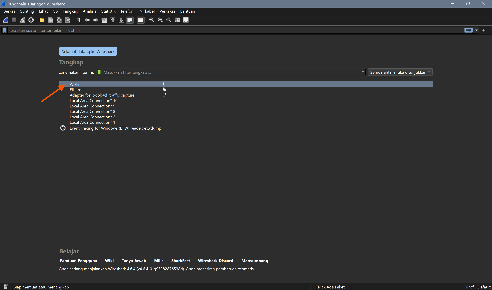
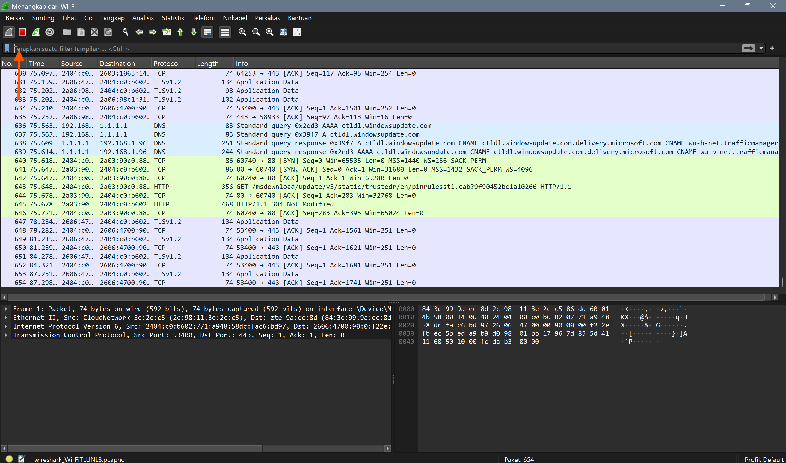

# Laporan praktikum jarkom w1

# Apa itu **Wireshark**
Wireshark adalah software untuk menganalisis lalu lintas jaringan (network traffic).
Artinya, Wireshark bisa menangkap dan menampilkan data yang lewat di jaringan internet secara detail.

## Instalasi **wireshark**
1. Unduh file melalui link berikut: http://www.wireshark.org/
2. Setelah file berhasil diunduh, jalankan file tersebut dan ikuti proses setup untuk menginstal Wireshark.

3. Klik “Next” pada setiap langkah hingga muncul opsi “Finish” seperti pada gambar di bawah ini.

4. Selesai.

## Menjalankan **Wireshark** dan **Melakukan Analisis HTTP**
1. Klik menu "wifi" dalam tampilan awal aplikasi

2. Saat Wireshark sedang berjalan, buka halaman website berikut untuk mengakses server HTTP:  http://gaia.cs.umass.edu/wiresharklabs/INTRO-wireshark-file1.html , lalu refresh.
3. Setelah halaman website terbuka, kembali ke aplikasi Wireshark. Pada kolom yang ditandai panah, ketikkan filter “http” untuk menampilkan riwayat akses HTTP.

4. Selanjutnya, cari baris yang pada bagian akhir kolom Info terdapat tulisan (text/html) seperti pada gambar di bawah ini

5. Selesai.

## **Kesimpulan**
Berdasarkan praktikum yang telah dilakukan, dapat disimpulkan bahwa Wireshark merupakan aplikasi yang digunakan untuk menganalisis lalu lintas jaringan secara detail. Melalui Wireshark, pengguna dapat menangkap dan memantau paket data yang dikirim dan diterima dalam suatu jaringan. Pada praktikum ini, Wireshark digunakan untuk mengamati aktivitas protokol HTTP dengan mengakses sebuah halaman website. Dengan menggunakan filter "http", paket data yang berkaitan dengan HTTP dapat ditampilkan sehingga memudahkan pengguna dalam melakukan analisis. Salah satu paket yang dapat diamati adalah paket dengan informasi (text/html) yang menunjukkan adanya pengiriman data halaman web dari server ke browser.
